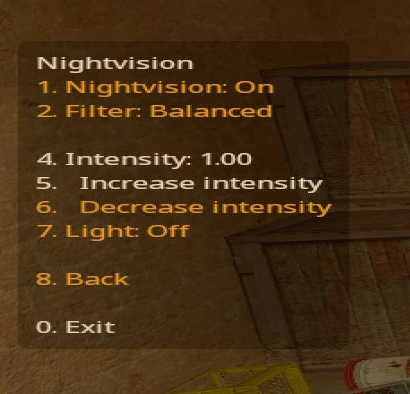

# Pro Nightvision

A custom nightvision plugin for Counter-Strike Source and Sourcemod.  Based off of [GAMMACASE's NightVision](https://github.com/GAMMACASE/NightVision) plugin.  I have only tested this with Counter-Strike Source, but may work with CSGO (if you are willing to help test let me know).

Custom nightvision filters allows adjustments to how nightvision goggles work by applying an adjustment over the player's screen.  Custom nightvision filters (`.raw` files) can be added by adding a database entry for them.  A database is not required if no custom nightvision filters are desired.

## Screenshots

Nightvision menu:


## Features

- Reactivates nightvision on respawn

- Support for custom nightvision filters

- Nightvision menu with intensity settings

- Nightvision light for very dark maps (may impact framerate depending on map; defaults to off).  This will add a light only the player can see (must have nightvision on).

- Easy to use, just press `n` (or whatever you use to activate nightvision) to activate/deactivate nightvision and bring up the nightvision menu.

- Natives are provided to control nightvision from other plugins

## Commands

- `!nv` or `!nightvision`: activates the last nightvision filter and brings up the nightvision menu.
- If using the ProEquip plugin the `!setnv` admin command can be used to activate/deactivate a nightvision filter.

## Installation

1. Copy the .SMX file to the `cstrike/addons/sourcemod/plugins` folder

### Installing Custom Filters

Optionally, custom nightvision filters can be added.  The files will be stored in the `materials` folder and the filters you want to allow players to use will be specified in a database.

1. Download nightvision templates and put them in the `cstrike/materials` folder.  This plugin does not currently come with any templates (and no templates are required to use it).
   
   For example, download GAMMACASE's nightvision templates, [https://github.com/GAMMACASE/NightVision/tree/master/materials/gammacase/nightvision](https://github.com/GAMMACASE/NightVision/tree/master/materials/gammacase/nightvision) , and put them somewhere like `cstrike/materials/gammecase/nightvision/`.
   
   Custom nightvision templates: https://github.com/GAMMACASE/NightVision#creating-custom-templates

2. Create a new database named `pro_nightvision`.  Code for MySQL:

```
CREATE TABLE `pro_nightvision` (
  `id` int(11) NOT NULL,
  `ordering` int(11) NOT NULL,
  `name` varchar(64) NOT NULL,
  `file` varchar(128) NOT NULL
) ENGINE=InnoDB DEFAULT CHARSET=latin1;

ALTER TABLE `pro_nightvision`
  ADD PRIMARY KEY (`id`);

ALTER TABLE `pro_nightvision`
  MODIFY `id` int(11) NOT NULL AUTO_INCREMENT;
```

3. Insert a record into the database for each filter (menu order determined by `ordering` field).  For example, when using GAMMACASE's filters you can use something like:

```
INSERT INTO `pro_nightvision` (`id`, `ordering`, `name`, `file`) VALUES
(1, 0, 'Balanced', 'materials/gammacase/nightvision/nv1.raw'),
(2, 2, 'Stronger', 'materials/gammacase/nightvision/nv2.raw'),
(3, 1, 'Strong', 'materials/gammacase/nightvision/nv3.raw'),
(4, 3, 'Strongest', 'materials/gammacase/nightvision/nv4.raw');
```

4. Add the following to your `cstrike/addons/sourcemod/configs/databases.cfg`, substituting your database information and credentials:

```
  "pro_nightvision"
    {
        "driver"            "default"
        "host"                "<hostname>"
        "database"        "<database>"
        "user"                "<username>"
        "pass"                "<password>"
    }
```

5. Copy the .smx file to the plugins folder (e.g. `cstrike/addons/sourcemod/plugins`) and load the file using `sm plugins load`.

## Credits

Based on GAMMACASE's plugin: https://github.com/GAMMACASE/NightVision
